# Helaketha Agri Frontend

Smart agriculture service platform that connects farmers with tractor drivers, harvester drivers, and fertilizer suppliers through secure role-based dashboards.

## Project Description

Helaketha Agri is a full-stack agriculture service management system.

- Frontend: `Next.js` (App Router), `React`, `TypeScript`, `Tailwind CSS`, `NextAuth`
- Backend: `Spring Boot` (`C:\Project\helaketha_agri_native\helaketha_agri_new`)
- Authentication: `Keycloak` + `NextAuth` (OAuth2/OIDC + JWT + role-based access)

The platform includes admin management modules, farmer booking flows, provider dashboards, secure API proxy routes, and modern UI for all roles.

## Core Features

- Role-based authentication and authorization
- Keycloak realm login integration
- Admin dashboards for:
  - Farmers
  - Tractor Drivers
  - Harvester Drivers
  - Fertilizer Suppliers
  - Service Bookings
- Farmer dashboard with booking creation and tracking
- Provider dashboards with profile update and booking management
- Next.js API proxy routes with secured backend communication

## Tech Stack

### Frontend
- Next.js (App Router)
- React
- TypeScript
- Tailwind CSS
- NextAuth.js

### Backend
- Spring Boot
- Java REST APIs
- OAuth2 Resource Server

### Authentication & Security
- Keycloak
- OAuth2 / OpenID Connect
- JWT
- Role-Based Access Control (RBAC)

## Screenshot Setup (Required)

Upload your screenshots into this folder:

- `docs/screenshots/`

Use these exact file names (recommended):

1. `01-project-overview.png`
2. `02-tech-stack.png`
3. `03-keycloak-login.png`
4. `04-admin-service-bookings.png`
5. `05-farmer-booking-table.png`
6. `06-admin-home-dashboard.png`
7. `07-fertilizer-provider-dashboard.png`
8. `08-farmers-management.png`
9. `09-farmer-dashboard.png`
10. `10-tractor-provider-dashboard.png`
11. `11-harvester-provider-dashboard.png`
12. `12-landing-page.png`

## Project Screenshots

### 1) Project Overview
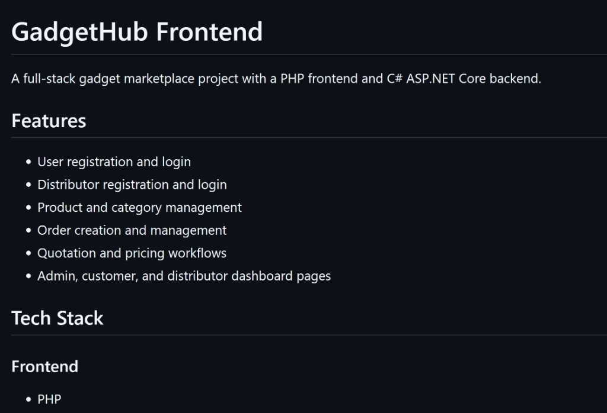

### 2) Tech Stack
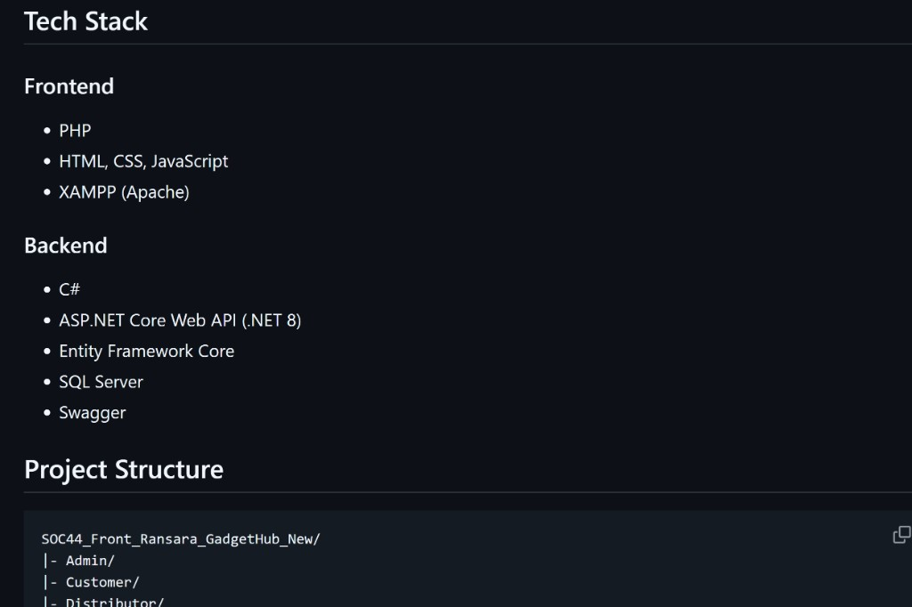

### 3) Keycloak Login
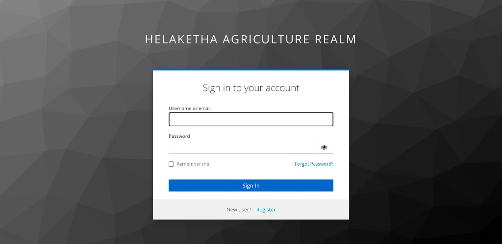

### 4) Admin - Service Bookings
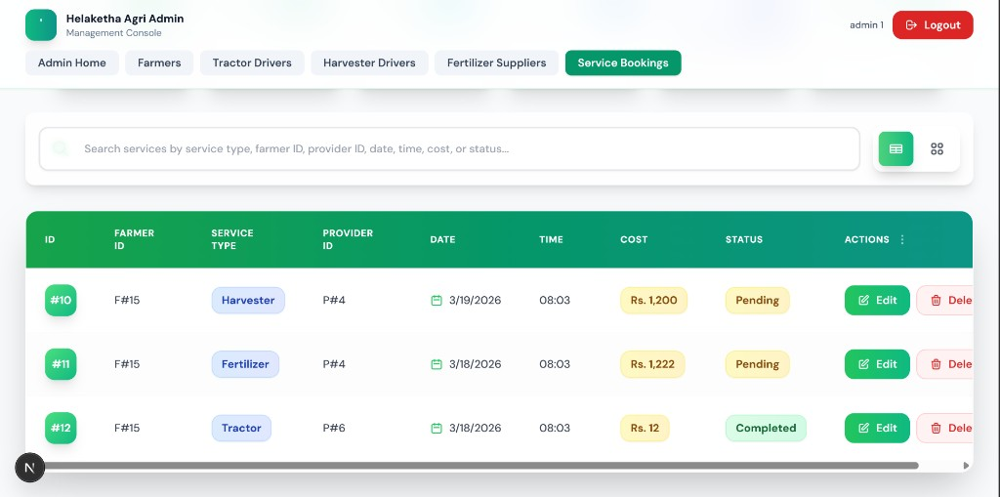

### 5) Farmer - Booking Details
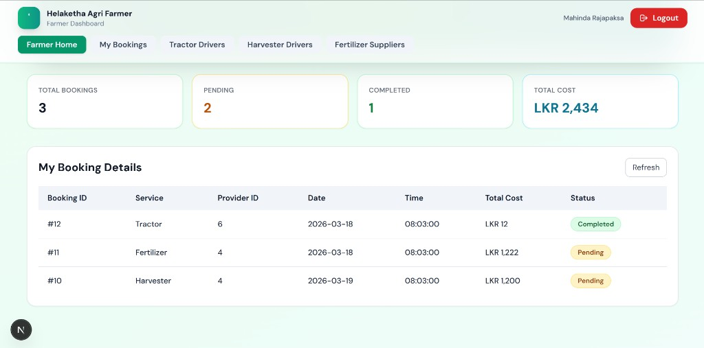

### 6) Admin - Home Dashboard
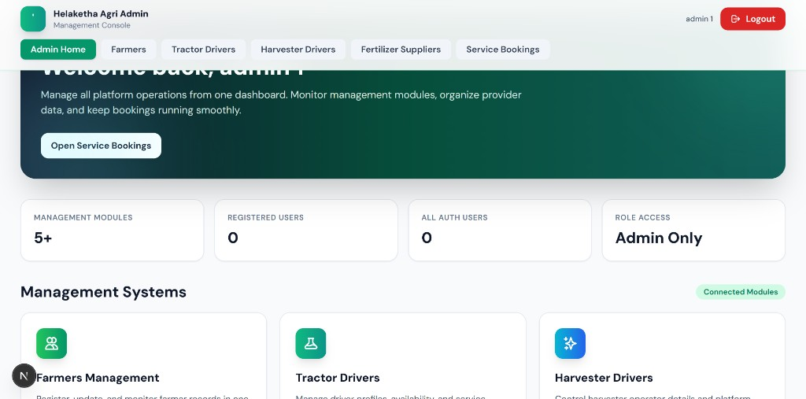

### 7) Fertilizer Supplier Dashboard
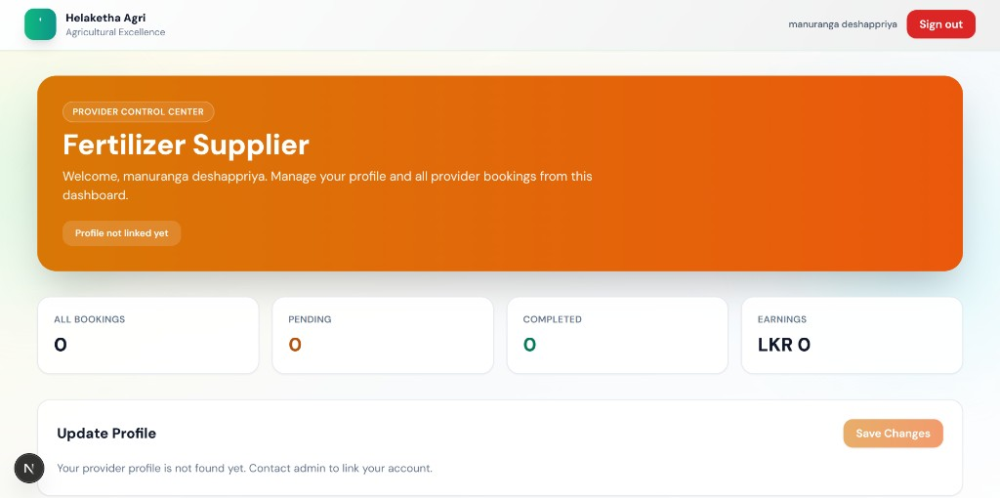

### 8) Farmers Management
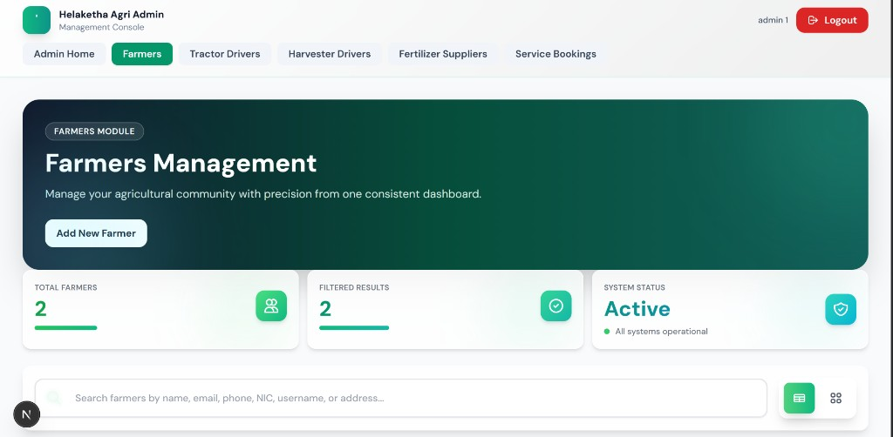

### 9) Farmer Dashboard
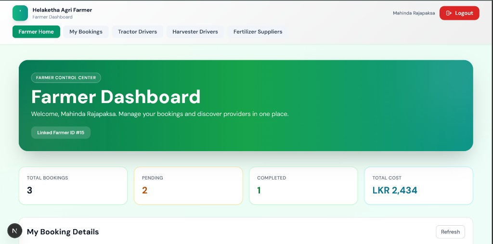

### 10) Tractor Driver Dashboard
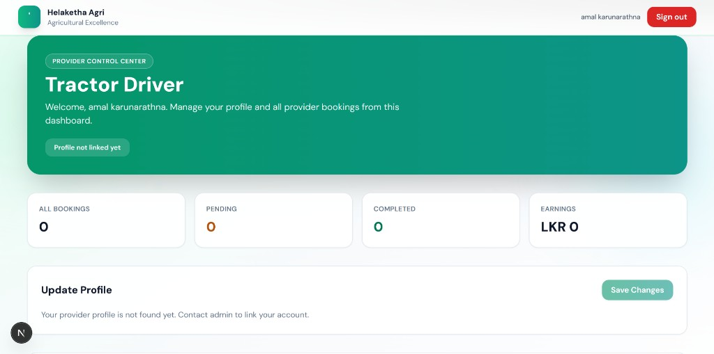

### 11) Harvester Driver Dashboard
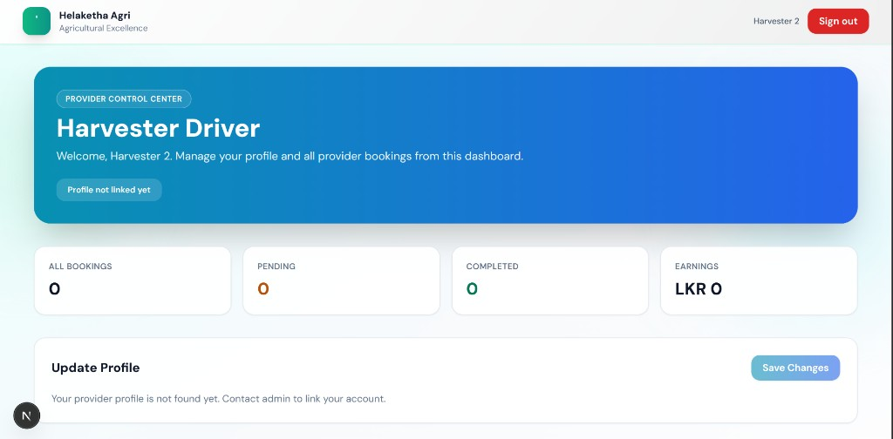

### 12) Landing Page
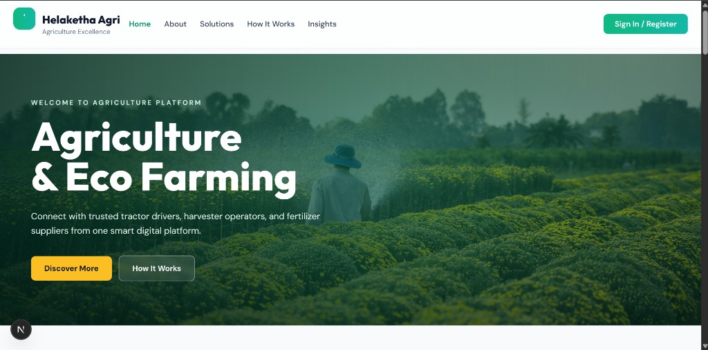

## Repository

- GitHub: [Helaketha_Agri_Frontend_new](https://github.com/Ransara1228/Helaketha_Agri_Frontend_new)
